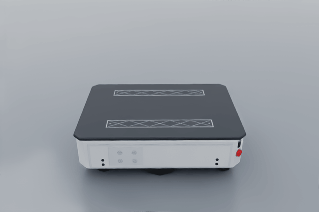
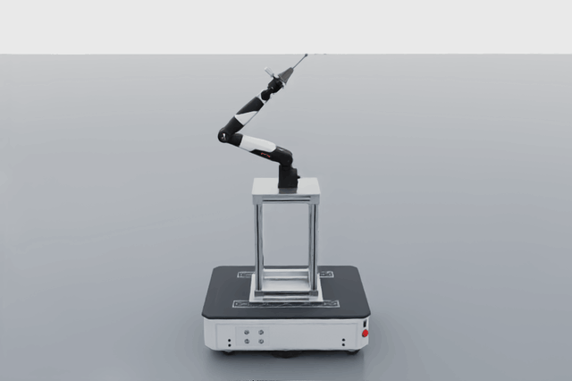
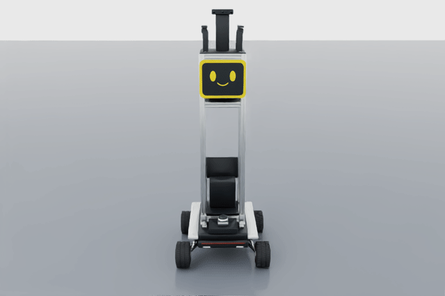
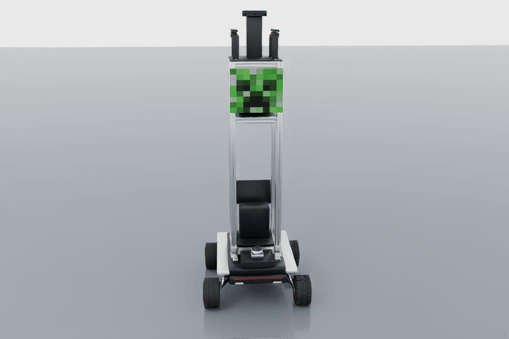

# APRL multi-floor robot simulator

**Ubuntu 24.04 · Isaac Sim 5.1.0 · ROS 2 Jazzy**

Office/House/Research 다층 환경에서 AMR, NERO 팔과 gripper를 장착한 locomanipulator,
또는 Scout Mini 센서 리그를 선택합니다. 실제 PhysX 바퀴 구동과 엘리베이터 접촉으로
이동하며, ROS teleop, RGBD, 로봇별 라이다·IMU, odometry, 관절 상태와 TF를 제공합니다.

| AMR | AMR + NERO |
|---|---|
| [](docs/amr-360.gif) | [](docs/locomanipulator-360.gif) |
| **Scout Mini · 기존 얼굴** | **Scout Mini · 크리퍼 얼굴** |
| [](docs/scout-360.gif) | [](docs/scout-creeper-360.gif) |

이미지를 누르면 실제 Isaac USD 렌더링으로 만든 360° 회전 GIF를 열 수 있습니다.

## 시작하기

기본 Isaac 설치 경로는 `~/isaacsim`입니다. 다른 경로는 `ISAAC_SIM_PATH`로 지정합니다.
다음 실행기는 zsh와 bash에서 동일하게 사용합니다.

```sh
cd ~/aprl_robot_sim
./scripts/sim --scene office --robot locomanipulator
# 환경: office | house | research, 로봇: amr | locomanipulator | scout
# 화면 없이 실행: --headless
```

`AMR_READY` 또는 `SCOUT_READY` 이후 별도 터미널에서:

```sh
./scripts/ros teleop
# 팔 관절과 gripper 조작은 별도 터미널에서:
./scripts/ros arm_teleop
```

기본 로봇은 `amr`, 기본 환경은 `office`입니다. Base teleop은 **w/s**, **a/d**,
**Space/x** 정지, **q** 종료입니다. 팔 teleop은 **1..7** 관절 선택, **j/k** 이동,
**o/c** gripper 열기/닫기입니다. 자세한 키와 데이터 계약은
[ROS 패키지 README](src/aprl_robot_sim/README.md)를 참고하세요.

호스트에는 ROS 2 Jazzy의 rclpy, 표준 메시지, NumPy, Fast DDS가 필요합니다.
Isaac는 번들 Python 3.11 Jazzy bridge, ROS 노드는 시스템 Python 3.12를 사용합니다.
실행기가 두 환경을 분리하므로 Isaac 실행 전에 ROS를 직접 source할 필요가 없습니다.
기본 `ROS_DOMAIN_ID=73`이며, 여러 실행은 각각 다른 domain을 사용하세요.

## 태블릿에서 Nav2 주행

Office 1층의 AMR / locomanipulator에 사용할 Nav2 실행, 설정, PGM 지도와 속도 중재기는
[src/aprl_navigation](src/aprl_navigation/README.md)에 있습니다. Captain Dalgu는
시각화와 ROS 명령만 담당하며 이 시뮬레이터 패키지가 AMCL과 Nav2를 실행합니다.

```sh
sudo apt install ros-jazzy-navigation2 ros-jazzy-nav2-bringup
./scripts/ros build
ROS_LOCALHOST_ONLY=1 ./scripts/sim --scene office --robot locomanipulator
# AMR_READY 이후 별도 터미널:
ROS_LOCALHOST_ONLY=1 ./scripts/ros nav2
# 별도 터미널:
cd ~/captain-dalgu
./scripts/run-aprl-sim.sh --nav2
./scripts/connect-tablet.sh
```

태블릿 Chrome의 `http://localhost:8080`에서 **Pose Estimate / Nav2 Goal**을 선택하고
지도에서 위치를 누른 채 방향으로 드래그한 다음 명령을 확정합니다. PGM 지도,
global/local costmap, 계획 경로, 남은 거리, 목표 취소를 지원합니다.
화면 연결 해제 또는 수동 조작 전환 시 목표를 취소하고 Nav2 속도를 차단합니다.
Nav2 모드에서는 기존 `teleop` / `route` 등 `/cmd_vel` 직접 발행 프로그램을 함께 실행하지 마세요.
다층 waypoint 예제는 기존 방식대로 독립 실행합니다. 새 Nav2 기본 지도는 Office 1층용이며,
엘리베이터를 이용한 층간 Nav2 계획과 Scout용 설정은 포함하지 않습니다.

## 환경과 GUI

| 환경 | 층 / 층간 높이 | 면적 | 엘리베이터 |
|---|---|---|---|
| office | 4층 / 3.6 m | 30 × 24 m | E1–E4 |
| house | 3층 / 3.4 m | 24 × 20 m | E1–E2 |
| research | B1·1F·2F·3F·4F·RF / 4 m | 60 × 18 m | E1–E3 |

Research는 `ELEVEN`의 연구동으로, B1 바닥이 Z=0 m이고 1F 바닥은 Z=4 m입니다.
E1은 유리 승강기, E2는 일반 승강기, E3는 소형 서비스 승강기입니다.
실행에 필요한 USD·텍스처를 포함하므로 원본 `~/ELEVEN` 없이 실행할 수 있습니다.

**Robot eye**, **Free view**, **Go to robot**, **Follow robot**으로 시점을 바꿉니다.
**Elevator controls** 또는 화면의 모델링된 버튼에서 호출·목적 층·문을 조작합니다.
GUI와 ROS 요청은 같은 엘리베이터 제어기를 사용합니다. 문 앞 장애물은 PhysX
overlap으로 감지하며, 이동 중 문 열기는 거부합니다. Pause는 일시정지,
Stop은 실행 종료입니다. 다시 실행하려면 스크립트를 새로 시작합니다.

## 5 m 이상 주행 → 버튼 누르기 → 탑승 → 다른 층 → 하차

새 시뮬레이터에서 아래 예제를 실행합니다. 예제는 실제 `/ground_truth/odom`을
피드백으로 `/cmd_vel`을 보내며, 위치를 강제로 옮기지 않습니다.

```sh
./scripts/sim --scene office --robot locomanipulator
# 별도 터미널:
./scripts/ros route --scene office --robot locomanipulator --report .runtime/office-route.json

# House는 새 실행에서:
./scripts/sim --scene house --robot locomanipulator
# 별도 터미널:
./scripts/ros route --scene house --robot locomanipulator --report .runtime/house-route.json

# Research는 새 실행에서:
./scripts/sim --scene research --robot locomanipulator
# 별도 터미널:
./scripts/ros route --scene research --robot locomanipulator --report .runtime/research-route.json
```

Office는 E2, House는 E1으로 1→2층을 이동합니다. 호출 전 실제 주행 거리 **6 m 이상**을
확인하고, 호출 버튼 앞에 정차한 뒤 팔을 접근시킵니다. Gripper에 고정된 작은
stylus와 버튼의 **PhysX 접촉 보고**가 발생해야 호출합니다. 팔을 접고 탑승한 뒤
객실 목적 층 버튼도 같은 방식으로 누릅니다. 승강기 도착 시 로봇의 실제 높이를
검사하고, 하차 후에도 6 m 이상 주행합니다. 보고서에는 접촉 위치·impulse와 실제
궤적이 남습니다.

Research 코스는 **B1 복도 12 m → E1 호출·탑승 → 1F 하차 → 복도 12 m**입니다.
시작 위치는 `(-14, 2.6, 0.025)` m이며, `amr`, `locomanipulator`, `scout`가 같은
코스를 사용합니다. ROS 명령과 예제 JSON의 층 번호는 아래 순서의 **1부터 시작하는
번호**입니다. 화면과 건물 버튼은 B1·1F·2F 등의 층 이름을 표시합니다.

| Research 층 | B1 | 1F | 2F | 3F | 4F | RF |
|---|---|---|---|---|---|---|
| ROS 명령 `floor` | 1 | 2 | 3 | 4 | 5 | 6 |
| 상태 `floor` / `targetFloor` | 0 | 1 | 2 | 3 | 4 | 5 |
| 바닥 Z (m) | 0 | 4 | 8 | 12 | 16 | 20 |

예제는 NERO 팔이 누를 수 있는 높이의 1F 목적 버튼을 사용합니다.
더 높은 층은 GUI 또는 ROS 엘리베이터 명령으로 선택할 수 있습니다.

팔의 180° yaw 장착에 맞춰 버튼 조작 시 차체 전면은 패널 반대쪽을 향합니다.
객실 패널에는 후진으로 접근해 팔로 버튼을 누르며, 전면 FLASH 라이다가 벽에 너무
가까워져 점군을 잃는 것을 방지합니다. 버튼 조작 후에는 전진으로 패널에서 벗어납니다.

`--robot amr` 또는 `--robot scout`를 양쪽 명령에 사용하면 팔 없이 같은 층간 주행을 수행하고, 버튼은
ROS 엘리베이터 API로 요청합니다. 이는 제공된 세 환경의 waypoint 예제입니다.
이 waypoint 예제 자체에는 Nav2 전역 경로 계획이나 임의 장애물 회피 기능이 없습니다.
예제 중에는 teleop이나 다른 명령 발행자를 함께 실행하지 마세요.

## 로봇과 센서

### Scout Mini

`~/scout_mini_isaac510_ros2_jazzy/scout_twin`의 USD, URDF, OBJ/MTL 메시와
`scout_twin_description` 패키지를 포함합니다. 원본 디렉터리 없이 실행할 수 있습니다.

Scout만 `--scout-face original|creeper`로 얼굴을 선택할 수 있으며 기본값은 `original`입니다.
크리퍼 얼굴은 첨부 이미지의 픽셀 무늬를 Blender로 모델링한 **264 × 218 mm** 패널로,
기존 얼굴의 위치와 전체 두께 **15.7 mm**를 유지합니다. 선택한 얼굴은 Isaac USD와
`/robot_description`의 URDF·메시에 함께 반영되어 RViz에서도 동일하게 표시됩니다.
주행·센서·질량·충돌체는 두 얼굴에서 동일합니다.

```sh
./scripts/sim --scene office --robot scout --scout-face creeper
# 기존 얼굴: --scout-face original 또는 옵션 생략
./scripts/sim --inspection --robot scout --scout-face creeper
```

```sh
./scripts/ros build
./scripts/sim --scene office --robot scout
# 별도 터미널에서 각각 실행:
./scripts/ros teleop
./scripts/ros rviz --robot scout
./scripts/ros verify --robot scout --report .runtime/scout-streams.json
# 경로 예제는 teleop을 종료하고 새 Scout 시뮬레이터에서 실행:
./scripts/ros route --scene office --robot scout --report .runtime/scout-route.json
```

Scout는 반지름 80 mm, 좌우 간격 490 mm의 4륜 skid steering 모델입니다.
전방·좌측·우측 Gemini 336L RGBD는 각각 640 × 400 / 15 Hz이며 RGB와 depth의
화각·intrinsics를 별도로 유지합니다. MID-360은 RTX 기반 360° / −7°~52°,
10 Hz, 0.1–40 m 점군과 내장 위치의 PhysX IMU 200 Hz를 제공합니다.
센서 토픽은 `/camera_{front,left,right}/{color,depth}/{image_raw,camera_info}`,
`/mid360/points`, `/mid360/imu`입니다. 설정은 [scout.json](config/scout.json)에 있습니다.

공통 `/cmd_vel`, `/odom`(바퀴 encoder), `/ground_truth/odom`(실제 PhysX 위치),
`/joint_states`, `/robot_description`, TF와 엘리베이터 API를 사용합니다.
Scout의 RGB와 depth는 화각이 달라 등록된 색상 점군을 발행하지 않습니다.
MID-360은 기하학적 스캔 근사이며 실제 Livox 비반복 패턴이나 장치 드라이버는 아닙니다.
설명 패키지 단독 미리보기와 이식한 검사 도구는
[Scout 패키지 README](src/scout_twin_description/README.md)를 참고하세요.

### AMR / locomanipulator

- 기본 차체: 800 × 580 × 245 mm, 차체·바퀴·캐스터의 기존 모델 유지.
- NERO: 제공된 `nero_with_gripper_description.urdf`의 7축 팔과 gripper 메시를 사용.
  원본은 [src/nero_description](src/nero_description)에 있으며 mesh URI를 새 패키지에 맞췄습니다.
- 장착부: 차체 상단 중앙의 **550 mm 알루미늄 프로파일 프레임**, 팔 기준 높이 795 mm.
  Blender로 기둥·가로대·홈·상하판·체결부를 모델링했습니다. 추정 질량은 8.100 kg이며
  부품 치수와 질량으로 계산한 무게중심·관성을 적용했습니다.
- 손목 카메라: [Gemini 305](https://www.devicemart.co.kr/goods/view?no=16015588)의
  **42 × 42 × 23 mm, 68 g**, 은색 곡면 하우징·검정 전면·18 mm 간격 렌즈 두 개·USB-C를
  Blender에서 모델링했습니다. [제조사 사양](https://store.orbbec.com/products/gemini-305)을 참고합니다.
- FLASH: 상단의 돌출 모델을 제거하고 전면 **큰 직사각형**에 통합했습니다.
  `base_link` 기준 `(0.400, 0, 0.022)` m, **13° pitch up**입니다.
  +X 전방/+Y 왼쪽/+Z 위 좌표계에서 Y 회전은 −13°이며 TF에도 같은 회전이 적용됩니다.
- 전방 RGBD: 전면 **작은 직사각형**, `base_link` 기준 `(0.400, 0, −0.045)` m.
  후방 RGBD는 기존 장착 위치를 유지합니다. 양쪽 모두 RGB·depth·색상 점군을 발행합니다.
- FLASH: RTX 192 × 56, 120° × 35°, 10 Hz, 0.3–80 m. IMU: PhysX 120 Hz.
  전·후 RGBD: 640 × 360 / 15 Hz / 0.4–6 m. 손목: 640 × 400 / 15 Hz / 0.04–1 m.
  점군은 가로·세로 2픽셀 간격으로 발행합니다. 설정은 [robot.json](config/robot.json)에 있습니다.

카메라 영상·depth는 RTX 렌더링입니다. 제품 치수와 외형을 재현하되 실제 장치의
전자회로·스테레오 오차·노이즈·공장 보정을 재현하는 드라이버 에뮬레이터는 아닙니다.
물리 모델의 추정값과 원본 URDF 처리 사항은 [자산 설명](docs/ASSETS.md)에 기록했습니다.

## ROS 데이터와 패키지 구조

```sh
./scripts/ros build
./scripts/ros verify --robot locomanipulator --report .runtime/streams.json
./scripts/ros rviz
./scripts/ros topic echo /robot_description --qos-durability transient_local --once
./scripts/ros topic hz /front_camera/depth/points
./scripts/ros topic hz /rear_camera/depth/points
./scripts/ros topic hz /wrist_camera/depth/points
```

`--robot`으로 선택한 전체 모델의 URDF를 `/robot_description` (`std_msgs/msg/String`)으로
발행합니다. Reliable / Transient Local QoS이므로 실행 후 접속한 구독자도 받습니다.
RViz의 Robot model은 이 토픽과 라이브 TF를 사용합니다. 메시의 `package://` 경로는
`./scripts/ros build` 후 해결되며, 실행기가 설치된 ROS 패키지를 자동으로 불러옵니다.

ROS 패키지·노드·예제·RViz·URDF는 모두 `src/` 아래에 있습니다.

```text
src/aprl_robot_sim/     Jazzy 노드, 예제, RViz, 완성 로봇 URDF·mesh, ROS 문서
src/nero_description/  제공된 NERO URDF·mesh와 ROS 패키지
src/scout_twin_description/ Scout Mini URDF·mesh, description launch와 검사 도구
isaac_runtime/         Isaac 실행, 물리·센서 bridge
assets/                실행용 USD, 환경·텍스처
config/                Isaac 센서·물리 설정
scripts/               sim, ros, container 실행기
docker/                Isaac 5.1 + Jazzy 이미지
docs/                 README 회전 영상, 자산 출처
```

colcon 설치 후 zsh는 `source install/setup.zsh`, bash는 `source install/setup.bash`를
사용합니다. [전체 ROS 토픽·TF·명령](src/aprl_robot_sim/README.md)을 참고하세요.

## Docker

NVIDIA Container Toolkit CDI와 Docker Compose가 필요합니다.
이미지는 공식 Isaac 5.1.0 바이너리와 Ubuntu 24.04 ROS Jazzy를 포함합니다.

```sh
export ACCEPT_EULA=Y PRIVACY_CONSENT=Y  # NVIDIA 약관과 개인정보 설정 확인 후 선택
./scripts/container build sim
SCENE=office ROBOT=locomanipulator ./scripts/container up sim
# 별도 터미널:
./scripts/container run --rm ros ./scripts/ros teleop
./scripts/container run --rm ros ./scripts/ros route --scene office --robot locomanipulator
./scripts/container run --rm ros ./scripts/ros verify --robot locomanipulator
```

House는 `SCENE=house`, Research는 `SCENE=research`, 기본 AMR은 `ROBOT=amr`,
Scout는 `ROBOT=scout`입니다. Headless 실행:

```sh
./scripts/container run --rm sim ./scripts/sim --headless --scene house --robot amr
./scripts/container down
```

GUI는 DISPLAY/X11을 사용합니다. 실행기는 현재 X 인증을 `.runtime/docker.xauth`에
복사합니다. 로그와 데이터는 `.runtime/`에 저장됩니다.
Elevator-LIO만 컨테이너로 실행하는 절차는 아래 섹션을 참고하세요.

## Elevator-LIO Docker만 실행하기

이 저장소의 [compose.yaml](compose.yaml)에 정의된 **`lio` 서비스만** 실행합니다.
호스트에서 실행 중인 Isaac Sim의 FLASH 점군과 IMU를 받아 LIO를 수행하는 구성입니다.
이 LIO 설정은 AMR/locomanipulator용입니다. Scout는 MID-360 토픽·센서 유형·extrinsic에
맞는 별도 LIO 설정이 필요하며, 아래 FLASH 설정을 그대로 사용하지 않습니다.
LIO 컨테이너는 ROS 2 Jazzy를 포함하며 GUI 없이 동작합니다. 이 서비스만 실행할 때는
Docker Engine과 Docker Compose가 필요하며, Isaac Sim Docker 이미지 빌드나 NVIDIA
Container Toolkit, X11 설정은 필요하지 않습니다. 시뮬레이터 실행 환경은 별도로 준비합니다.

### 1. Elevator-LIO 소스와 환경 변수 준비

`Elevator-LIO`는 이 저장소에 포함되어 있지 않으므로 별도 체크아웃이 필요합니다.
기본 배치는 `~/aprl_robot_sim`과 `~/Elevator-LIO`를 나란히 두는 방식입니다.
다음 명령은 **호스트 터미널**에서 실행합니다.

```sh
cd ~/aprl_robot_sim
export ELEVATOR_LIO_PATH="$HOME/Elevator-LIO"  # 실제 체크아웃의 절대 경로로 변경 가능
export ROS_DOMAIN_ID=73

docker compose version
docker info >/dev/null

# Dockerfile과 Isaac Sim용 루트 설정 및 참조 설정이 모두 있어야 합니다.
ls "$ELEVATOR_LIO_PATH/Dockerfile" \
   "$ELEVATOR_LIO_PATH/yaml/isaac_sim.yaml" \
   "$ELEVATOR_LIO_PATH/yaml/sensors/isaac_flash.yaml" \
   "$ELEVATOR_LIO_PATH/yaml/runtime/isaac_sim.yaml" \
   "$ELEVATOR_LIO_PATH/yaml/logging/default.yaml"
```

`ELEVATOR_LIO_PATH`를 생략하면 이 저장소 기준 `../Elevator-LIO`를 사용합니다.
새 호스트 터미널에서도 같은 경로와 `ROS_DOMAIN_ID`를 설정하세요. 특히 이미 설정된
`ROS_DOMAIN_ID`가 있으면 기본값 73보다 우선하므로, 시뮬레이터와 LIO에 같은 값을 명시합니다.
외부 체크아웃의 Dockerfile은 `ROS_DISTRO=jazzy`, `UBUNTU_CODENAME=noble` 빌드 인자와
`/ros2_ws/install` 설치 구조를 지원해야 합니다.

### 2. LIO 이미지만 빌드하고 실행

```sh
# 최초 실행 또는 Elevator-LIO 소스 변경 후 빌드
./scripts/container --profile lio build lio

# LIO 서비스만 백그라운드 실행
./scripts/container --profile lio up -d --no-deps lio

# 컨테이너 상태와 시작 로그 확인
./scripts/container --profile lio ps -a lio
./scripts/container --profile lio logs --tail=100 -f lio
```

이미지 이름은 `elevator-lio:jazzy-sim`입니다. 기존 이미지가 있으면 빌드 단계를 생략할 수
있습니다. 빌드 메모리가 부족하면 `BUILD_JOBS=2 ./scripts/container --profile lio build lio`로
병렬 빌드 수를 줄입니다. 기본값은 4입니다.

**실행 명령 끝의 `lio`를 반드시 포함하세요.** `--profile lio up -d`만 실행하면 기본 서비스인
`sim`도 시작 대상이 됩니다. 위 명령의 `--no-deps lio`는 실행 대상을 LIO로 한정합니다.
`logs -f`에서 **Ctrl+C**를 누르면 로그 조회만 끝나며 백그라운드 LIO는 계속 실행됩니다.

컨테이너의 기본 실행 명령은 다음과 같습니다. 위 `up`이 자동 실행하므로 별도로 입력할
필요는 없습니다.

```sh
ros2 run lio lio --ros-args -p config_path:=isaac_sim.yaml -p use_sim_time:=true
```

Livox, Orbbec, GX5 실물 드라이버는 모두 비활성화되어 있습니다. 컨테이너는 호스트
네트워크와 IPC를 공유하고 `RMW_IMPLEMENTATION=rmw_fastrtps_cpp`를 사용합니다.

### 3. 시뮬레이터 입력 연결

LIO 컨테이너는 센서 데이터를 생성하지 않으므로, 다음 토픽을 발행하는 시뮬레이터가
같은 ROS domain에서 실행되어 있어야 합니다. 컨테이너가 실행 중이어도 입력이 없으면
위치 추정 결과가 나오지 않습니다.

| 입력 토픽 | 메시지 형식 | 용도 |
|---|---|---|
| `/clock` | `rosgraph_msgs/msg/Clock` | `use_sim_time:=true`에서 사용하는 시뮬레이션 시간 |
| `/mlx/pointcloud` | `sensor_msgs/msg/PointCloud2` | FLASH 점군: x/y/z/intensity float32, t uint32 ns |
| `/imu/data` | `sensor_msgs/msg/Imu` | IMU 가속도와 각속도 |

이미 시뮬레이터를 실행했다면 그대로 사용합니다. 새로 시작하는 경우 **별도 호스트 터미널**에서:

```sh
cd ~/aprl_robot_sim
export ROS_DOMAIN_ID=73
./scripts/sim --scene office --robot amr
# 팔 장착 모델: --robot locomanipulator, 화면 없이 실행: --headless
```

`AMR_READY`가 표시되고 LIO가 초기화될 때까지 로봇을 정지 상태로 둡니다.
시뮬레이터를 Pause하면 센서와 시뮬레이션 시간 진행도 멈춥니다.

### 4. 컨테이너 안에서 실제 수신과 LIO 출력 확인

별도 호스트 터미널에서 같은 `ELEVATOR_LIO_PATH`, `ROS_DOMAIN_ID`를 설정한 뒤 접속합니다.

```sh
cd ~/aprl_robot_sim
export ELEVATOR_LIO_PATH="$HOME/Elevator-LIO"
export ROS_DOMAIN_ID=73
./scripts/container --profile lio exec lio bash
```

이후 명령은 **컨테이너 안의 bash**에서 실행합니다. `compose exec`로 연 셸에는 이미지의
entrypoint가 다시 실행되지 않으므로 ROS와 LIO 작업 공간을 직접 source합니다.

```sh
source /opt/ros/jazzy/setup.bash
source /ros2_ws/install/setup.bash

ros2 node list
ros2 param get /lio_node use_sim_time
ros2 topic echo /clock --once

# hz 명령은 주기 값이 반복 출력되는지 확인한 뒤 Ctrl+C로 끝내고 다음 명령을 실행합니다.
ros2 topic hz /mlx/pointcloud
ros2 topic hz /imu/data

# 초기화 후 LIO가 실제 추정 결과와 처리한 점군을 발행하는지 확인
ros2 topic echo /LIO/odom_imu --once
ros2 topic hz /LIO/clouds_lidar

exit
```

`/lio_node`가 보이고 `use_sim_time`이 `True`여야 합니다. 입력 토픽의 수신 주기와
`/LIO/odom_imu` 메시지, `/LIO/clouds_lidar`의 연속 발행까지 확인합니다.
`ps`에 `Up`이 표시되거나 토픽 이름이 보이는 것만으로는 데이터 처리 여부를 알 수 없습니다.
셸의 `exit`도 LIO 프로세스를 종료하지 않습니다.

### 5. 설정 변경, 저장 위치와 종료

외부 저장소의 `yaml/` 전체가 컨테이너의 `/ros2_ws/install/share/lio/yaml`에 읽기 전용으로
연결됩니다. 호스트의 다음 파일을 수정한 뒤 LIO를 재시작하면 적용되며, YAML만 변경했다면
이미지를 다시 빌드할 필요가 없습니다.

| 호스트 파일 (`$ELEVATOR_LIO_PATH` 기준) | 내용 |
|---|---|
| `yaml/isaac_sim.yaml` | 센서·실행·로그 설정 파일을 선택하는 루트 설정 |
| `yaml/sensors/isaac_flash.yaml` | 입력 토픽, `lidar_type`, IMU/LiDAR/body 간 고정 extrinsic |
| `yaml/runtime/isaac_sim.yaml` | 다운샘플링, 지도 저장, 출력 토픽, 엘리베이터 모드 |
| `yaml/logging/default.yaml` | 콘솔·파일 로그 설정 |

FLASH의 현재 위치는 `base_link` 기준 `(0.400, 0, 0.022)` m, 회전은 **13° pitch up**
(Y축 회전 −13°)입니다. 센서 설정의 `offset.imu_t_lidar`, `offset.imu_R_lidar`,
`offset.lidar_t_body`, `offset.lidar_R_body`도 이 장착 상태와 일치해야 합니다.
센서 위치를 바꾸면 [robot.json](config/robot.json)과 외부 LIO 설정을 함께 확인하세요.

호스트의 `./scripts/container`는 사용자 UID/GID와 필요한 저장 디렉터리를 준비합니다.
실행 결과는 다음 경로에 보존됩니다.

| 호스트 경로 | 내용 |
|---|---|
| `.runtime/lio/ros/` | ROS 상태와 로그 (`ROS_HOME`) |
| `.runtime/lio/PCD/` | PCD 저장을 활성화했을 때의 점군 파일 |
| `.runtime/lio/temp/` | LIO 실행 로그와 궤적 등 설정에 따른 출력 |

다음 관리 명령은 **호스트 터미널**에서 실행합니다.

```sh
# YAML 변경 반영
./scripts/container --profile lio restart lio

# 소스를 수정했다면 이미지를 다시 빌드한 뒤 새 이미지로 실행
./scripts/container --profile lio build lio
./scripts/container --profile lio up -d --no-deps lio

# LIO만 종료
./scripts/container --profile lio stop -t 30 lio

# 종료된 LIO 컨테이너도 삭제하려는 경우
./scripts/container --profile lio rm -f lio
```

`stop`과 `rm` 이후에도 위 호스트 저장 경로의 파일은 남습니다.
`ELEVATOR_LIO_PATH`나 `ROS_DOMAIN_ID`를 바꾼 경우에는 `restart` 대신 변경한 값을 export하고
`./scripts/container --profile lio up -d --no-deps lio`를 실행해 컨테이너 설정을 반영합니다.

실행이 안 되면 먼저 `ps -a lio`와 `logs --tail=100 lio`로 종료 원인을 확인하세요.
빌드 경로 또는 YAML 파일 오류는 1단계의 체크아웃과 참조 파일을 확인합니다.
토픽 수신이 없으면 양쪽 `ROS_DOMAIN_ID`, 시뮬레이터의 실행·Pause 상태와 `/clock`,
`/mlx/pointcloud`, `/imu/data`의 실제 발행 여부를 4단계 명령으로 확인합니다.

## 모델 확인

제공된 USD와 ROS URDF·메시로 바로 실행할 수 있으며 Blender는 필요하지 않습니다.
회전 시점에서 로봇을 확인하려면 다음 명령을 사용합니다.

```sh
./scripts/sim --inspection --robot locomanipulator
```

`--robot amr`로 기본 AMR, `--robot scout`로 Scout Mini를 확인할 수 있습니다.
Scout 크리퍼 얼굴은 `--robot scout --scout-face creeper`로 확인합니다.
편집 가능한 [Blender 원본](assets/robot/components/scout_creeper_face.blend)과
[재생성 스크립트](scripts/build-scout-face.py)를 포함합니다. Blender 4.0.2와
OpenUSD Python 바인딩이 설치된 개발 환경에서 `python3 scripts/build-scout-face.py`로
크리퍼 자산을 재생성할 수 있습니다. 일반 실행에는 Blender가 필요하지 않습니다.

검증 기록·주행 녹화·회전 MP4·Blender 원본·모델 재생성 도구·미사용 NERO 변형 모델은
위 크리퍼 원본·스크립트를 제외하고 로컬 개발 자료로 보관하며 Git 및 Docker 배포에서 제외합니다.
README의 회전 GIF, 실행용 자산, 자산 출처 문서는 배포에 포함합니다.

# Future Work

- [ ] README 정리
- [ ] 코드 정리
- [ ] Dockerize 검증
- [ ] Elevator-LIO 검증
