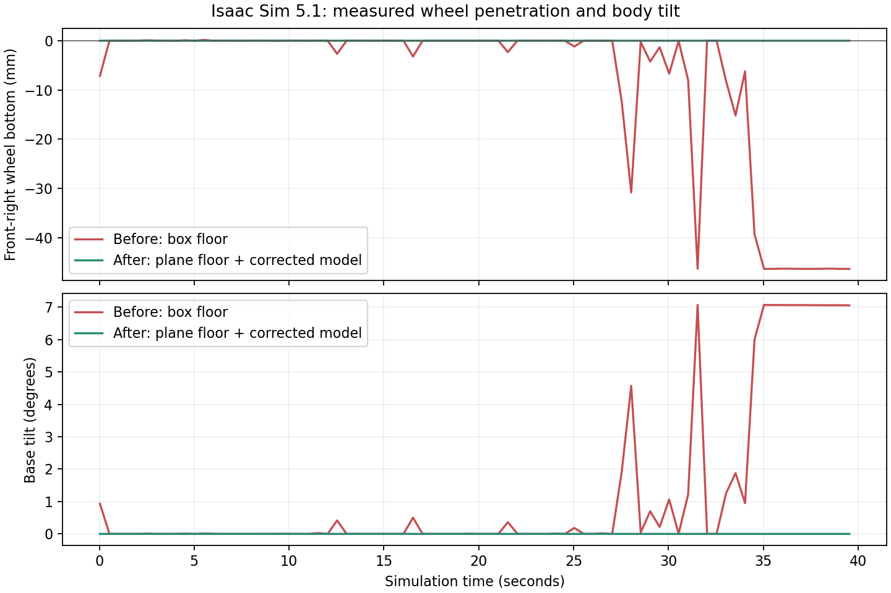

# AMR caster 침하·카메라 수정 및 실제 실행 검증

2026-09-09. Ubuntu 24.04.4 LTS, Isaac Sim 5.1.0, ROS 2 Jazzy, RTX 5070 Ti 16 GB, NVIDIA driver 580.142에서 실행했다. README의 `run_sim.sh`, `run_ros_tools.sh`를 사용했고, ROS 환경변수를 분리했다. 검증용 ROS_DOMAIN_ID는 73~77을 사용했다. 시스템 ROS/셸/Isaac 설치 파일은 변경하지 않았다.

## 결과

전방 우측 caster의 지면 침하와 차체 기울어짐을 실제로 재현하고 수정했다. 앞뒤 RGB·깊이 수집과 ROS 발행을 복구했다. 빈 차체와 250 kg 적재, 다른 caster 시작 방향에서 GUI/Headless 실행 및 전진·후진·좌우 회전·정지 검사를 통과했다.

| 실행 | 시뮬레이션 시간 | 최대 바퀴 침하 | 최대 차체 기울기 | 앞/뒤 카메라 프레임 |
|---|---:|---:|---:|---:|
| 기존 물리 설정, 카메라만 수정 | 40 s | 46.373 mm | 7.073° | 599 / 599 |
| 수정 형상, 빈 차체 GUI | 95 s | 0.000196 mm | 0.000° | 1424 / 1424 |
| 수정 형상, 250 kg GUI | 100 s | 0.001119 mm | 0.001017° | 1499 / 1499 |
| 최종 코드, 빈 차체·caster 90° | 65 s | 0.003445 mm | 0.001185° | 974 / 974 |
| 최종 코드, 250 kg·caster 270° GUI | 85 s | 0.001006 mm | 0.001219° | 1274 / 1274 |

침하는 PhysX 강체 위치·회전과 원통 치수로 계산한 최저점이 z=0 아래에 있는 거리다. 초기 2초 이후를 집계했다. 최종 코드는 10 Hz로 상태를 검사하며, 선택적 상세 기록은 2 Hz다. 작은 소수점 값은 수치 계산 결과이며 실물 정확도를 의미하지 않는다. 수정 형상의 첫 두 GUI 실행에는 접촉력 진단 코드가 있었고, 마지막 두 실행은 이를 제거한 최종 코드로 검증했다.



## Caster 원인 분리와 수정

1. 원래 USD에는 타이어 6개의 collider가 존재했고 초기 접지 높이도 맞았다. 실제 실행에서는 전방 우측 caster와 우측 구동륜이 큰 박스 형태의 바닥을 파고들었다.
2. TGS velocity iteration 8→1만 바꾸거나 external-forces 옵션을 추가해도 일시적인 침하·기울기·이동이 남았다.
3. 동일 로봇에서 바닥만 `Plane`으로 바꾸면 기존 velocity iteration 8에서도 25초 동안 침하가 사라졌다. 평면+iteration 1에서는 빈 차체 30초와 적재 35초 모두 안정적이었다. 따라서 이 재현에서 핵심은 원통 바퀴와 큰 박스 바닥의 접촉 조합이었다. PhysX 내부 알고리즘의 특정 결함까지 규명했다고 주장하지 않는다.
4. 기본/적재 월드 모두 시각적 바닥과 물리 접지면을 분리했다. `/World/Ground/Visual`은 기존 12×10 m 바닥이며 `/World/Ground/CollisionPlane`은 z=0의 물리 평면이다. TGS는 32 position / 1 velocity iteration, physics 120 Hz를 사용한다.
5. 차체 collision을 분할해 구동륜과 caster 회전 공간을 비웠다. Caster 포크 8개·베어링 4개에도 외부 collision을 추가했다. 원통 타이어 치수, 11 rigid bodies, 10 joints, 100/350 kg 총질량은 유지했다.
6. 로봇 collider는 8→25개, 기본 월드는 19→36개, 적재 월드는 20→37개다.

실험용 USD의 참조는 보존된 `baseline/assets/`로 연결해 재실행 가능하게 정리했다. 참조 대상 내용은 실험 당시 자산과 동일하다.

## 카메라와 종료 처리

- 설치된 Camera API는 색상을 `rgb` 키에 저장한다. 기존 `frame.get("rgba")`는 항상 None이 되어 발행을 건너뛰었다.
- `rendering_frame`은 정수가 아니라 ReferenceTime 분자/분모 딕셔너리다. `int(frame_number)` 대신 정규화한 유리수 키로 중복을 검사한다. ROS stamp는 같은 프레임의 `rendering_time`을 사용한다.
- 빈 수집기 버퍼와 키/크기/시간 오류를 구분한다. 형식 오류에는 카메라 이름과 원인이 출력된다.
- 오류·최종 상태·보고서를 `app.close()` 전에 저장한다. `post_quit(return_code)`로 성공 0 / 실패 1을 전달한다.
- 이 설치에서는 fast shutdown을 끄면 종료 후 Python GC에서 segmentation fault가 재현됐다. 최종 코드는 기본 fast shutdown을 유지하면서 종료 전 보고서와 반환 코드를 확정한다.
- 자산 생성 스크립트의 `pxr` 미등록 오류를 수정했다. `run_usd_tool.py`가 Isaac을 초기화한 뒤 USD 도구를 실행한다. 검증기의 새 OpenUSD 전용 `GetCompositionErrors()` 사용도 설치된 USD와 호환되게 바꿨다.

## 물리 상태 검사

센서 준비와 함께 0.5초 이상 안정적인 접지·자세를 확인한 뒤 `AMR_READY`와 주행 명령을 허용한다. 초기 2초 이후 2 mm 초과 침하 또는 5° 초과 기울기가 0.5초 지속되면 원인을 기록하고 실패 종료한다.

원래 박스 바닥 월드로 최종 코드를 실행하면 다음 오류를 기록하고 종료 코드 1로 중단했다:

```
Physics contact check failed: right_drive penetrated 17.47 mm; caster_fr_wheel penetrated 30.83 mm
```

센서 준비 시간을 의도적으로 0.001초로 제한한 실패 시험도 보고서를 저장하고 종료 코드 1을 반환했다.

## 검증 증거

- [최종 빈 차체 기록](final_empty_yaw90.json), [최종 적재 기록](final_payload_yaw270.json)
- [빈 차체 15개 ROS 토픽/TF/주행 검사](smoke_empty_yaw90.json), [적재 검사](smoke_payload_yaw270.json): 모두 `passed=true`.
- 최종 빈 차체: 전진 0.259 m, 후진 0.207 m, 좌회전 +0.622 rad, 우회전 −0.491 rad. 적재: 전진 0.246 m, 후진 0.220 m, 좌회전 +0.540 rad, 우회전 −0.407 rad. 각 동작 후 정지 기준 통과.
- [물리 실패 검출](physics_guard_negative.json), [시작 실패 검출](final_startup_negative.json)
- [단위 검사](unit_tests.log): 17/17 통과.
- [Isaac에 포함된 USD로 수행한 검사](usd_validation_isaac.json): 103/103 통과. Fork/Bearing collision, 차체-구동륜 간섭, caster의 5° 간격 72개 선회 자세를 추가 검사한다.
- [빈 차체 GUI](final_empty_gui.png), [적재 GUI](final_payload_gui.png)
- 실제 ROS 수신 이미지: [앞](images_empty/front.png), [뒤](images_empty/rear.png), [적재 앞](images_payload/front.png), [적재 뒤](images_payload/rear.png). 두 카메라 모두 640×360이며, depth와 CameraInfo도 외부 smoke 검사에서 확인했다.
- [결과 요약 JSON](results_summary.json), [검토한 소스 diff](review_diff.patch), [최종 소스 해시](final_source_sha256.json), [변경 파일 목록](changed_files.json)

## 범위와 한계

- 제공된 평면 테스트 월드의 접지·기초 주행·스트림 검증이다. 2 m/s 최대속도, 정밀 경로 추종, 제동거리, 경사로, 임의의 외부 맵 및 실물 적재 성능을 인증하지 않는다. Caster 초기 방향에 따라 선회 정렬 과정의 횡이동이 나타나므로 주행 결과의 실제 수치를 함께 제공한다.
- 평면 collider는 시각적 바닥 밖으로도 이어진다. 제공된 벽 안쪽이 검증 영역이다.
- Plane 접촉에서 해당 설치의 tensor contact-force readback은 0을 반환했다. 이를 지지력으로 해석하지 않았고, 관련 진단 코드는 제거했다. 최종 검증과 보호 동작은 실제 PhysX 자세, 바퀴 최저점, 차체 기울기, 주행 응답을 사용한다. 바퀴별 지지력 분포는 검증 완료 항목이 아니다.
- DLSS 저해상도 조정·데이터 복사 성능 경고 등은 남을 수 있다. 실제 RGB/depth 데이터와 ROS 수신을 확인했으며, 이 경고들은 확인된 수집 실패의 원인이 아니었다.
- 호스트 LSP는 Isaac 전용 import와 USD 바인딩을 해석하지 못한다. 실제 Isaac 실행과 포함된 USD 검증을 근거로 삼았다. 주석 검사 플러그인은 실행 파일이 없어 사용하지 못했다.

참고: [Omni Physics 107.3 TGS 설정](https://docs.omniverse.nvidia.com/kit/docs/omni_physics/107.3/dev_guide/simulation_control/simulation_control.html#physics-solver), [Isaac 5.1 Camera API](https://docs.isaacsim.omniverse.nvidia.com/5.1.0/py/source/extensions/isaacsim.sensors.camera/docs/index.html).
