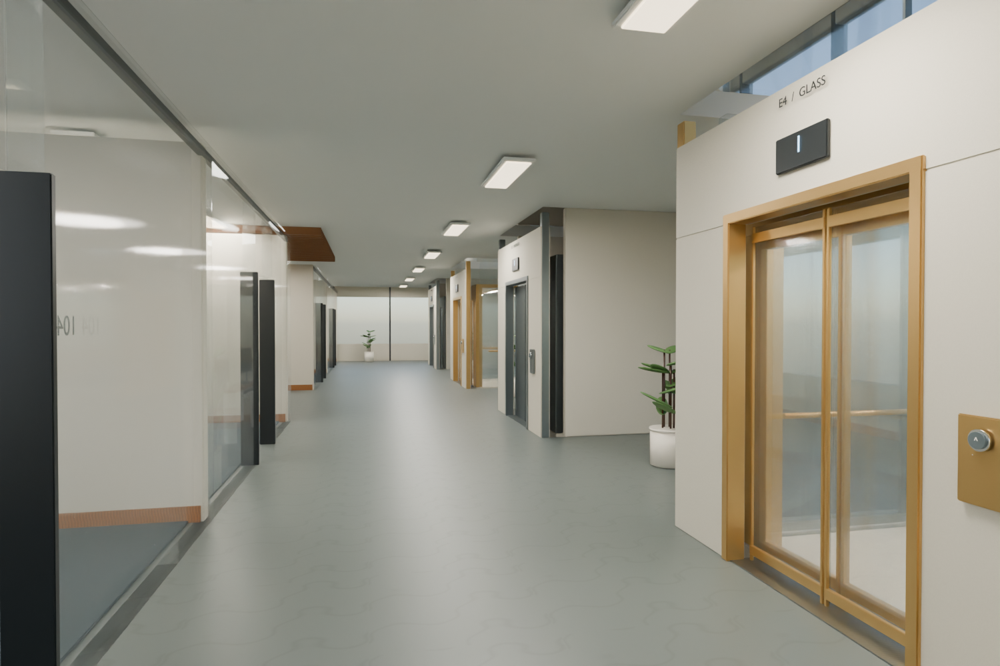
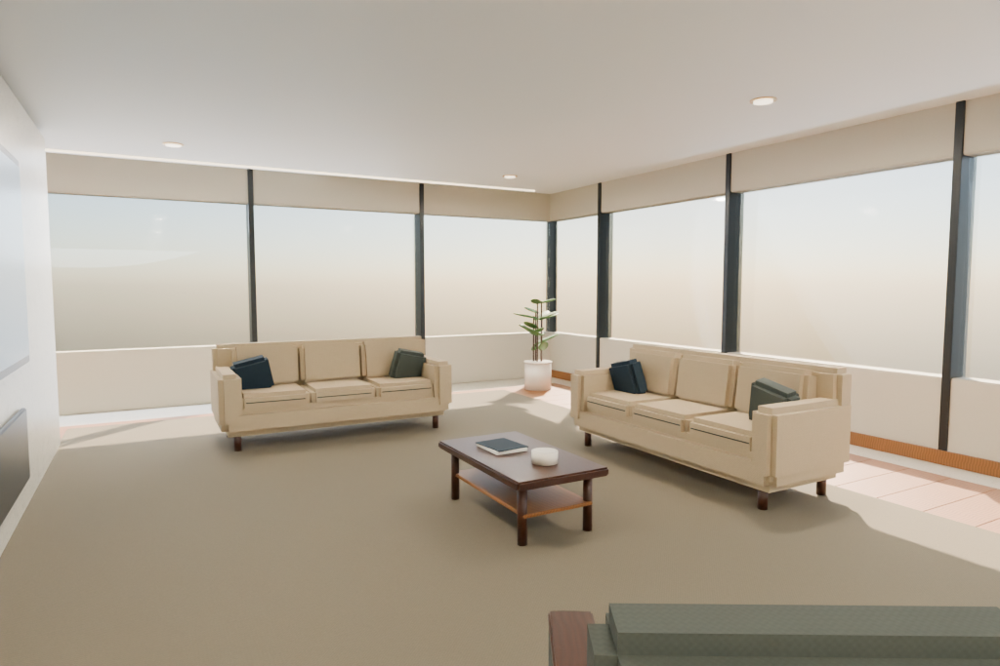

# Multi-floor indoor simulation testbed

Blender에서 직접 제작한 다층 오피스와 대형 주택, 작동하는 불투명·유리
엘리베이터, 브라우저 탐색 데모, Isaac Sim **5.1.0**용 USD 씬입니다.

| 환경 | 규모 | 공간 | 엘리베이터 |
|---|---|---|---|
| Atrium Office | 4층, 30 × 24 m, 층간 3.6 m | 다수의 독립 사무실·회의실, 공용 업무 공간, 리셉션·라운지 | 4대: 불투명 2, 유리 2 |
| Garden Residence | 3층, 24 × 20 m, 층간 3.4 m | 주방·식당·거실, 침실·욕실·서재·가족 라운지 | 2대: 불투명 1, 유리 1 |

모든 길이는 미터, USD의 상향 축은 Z입니다. 사용자 표시 층은 1부터,
프로그래밍 API와 USD의 `Floor_N` 인덱스는 0부터 시작합니다.

## 웹 데모

[웹에서 바로 탐색하기](https://multifloor-testbed.hgim74985.chatgpt.site) · 소유자 로그인 필요

```bash
python -m http.server 8080 --directory web/dist
```

브라우저에서 `http://localhost:8080`을 엽니다. 의존 모듈과 glTF 모델을
함께 제공하므로 별도 npm 설치나 CDN 연결은 필요 없습니다.

- Office / Residence를 선택하고 층별 로비, 전체 구조, 자유 시점으로 탐색합니다.
- 엘리베이터를 고른 뒤 **탑승하여 내부 보기**로 내부 패널을 살펴봅니다.
- 화면 패널 또는 실제 3D 버튼을 눌러 목적 층을 요청합니다.
- 누른 요청만 점등되고, 도착 후 문이 완전히 열리면 소등됩니다.
- 수동 열기·닫기·경보 버튼, 층별 호출, 출입구 장애물 상태를 확인할 수 있습니다.
- 자유 이동: WASD/방향키, 드래그로 시선, Q/E로 높이, Shift로 빠른 이동.

웹의 자유 이동은 시각적 탐색용 비행 카메라입니다. 충돌·접촉·탑승체 물리는
Isaac Sim에서 처리합니다. 웹의 PBR 렌더링과 Blender Cycles/Isaac RTX의
광선 추적은 반사·투명도·조명 결과가 다릅니다.

## Isaac Sim 5.1.0

바로 열 수 있는 씬:

- `scenes/office.usda`
- `scenes/house.usda`

USD는 원래 상태의 정적 환경으로도 열립니다. 엘리베이터를 움직이려면
동봉한 실행기 또는 Script Editor 런타임을 사용합니다.

```bash
# Isaac Sim 설치 디렉터리의 python.sh 사용
./python.sh /absolute/path/testbed_for_sim/isaac/run.py --scene office
./python.sh /absolute/path/testbed_for_sim/isaac/run.py --scene house --renderer PathTracing
```

자세한 버튼 입력, 로봇 연동 API, 문 안전 센서, 헤드리스 실행과 탑승 물리
검증은 [Isaac Sim 사용 가이드](docs/isaac_sim.md)를 참고하세요.

## 에셋과 제작 원본





| 파일 | 용도 |
|---|---|
| `assets/office.blend`, `assets/house.blend` | 편집 가능한 Blender 제작 원본 |
| `assets/office.gltf`, `assets/house.gltf`, `assets/*_*.bin` | 표준 glTF 에셋과 분리된 버퍼; 웹에도 동일한 바이트 사용 |
| `assets/*_manifest.json` | 층 높이, 샤프트, 노드, 버튼, 카메라와 치수 기록 |
| `assets/textures/` | 원본 PBR 텍스처 |
| `scenes/*_geometry.usdc` | Blender에서 내보낸 지오메트리·재질 |
| `scenes/*.usda` | Isaac 물리·충돌·버튼 속성을 결합한 월드 진입점 |
| `docs/renders/` | 실제 모델에서 렌더링한 검토 이미지 |
| `simulation/elevator.py`, `.mjs` | 같은 상태 전이와 가감속을 사용하는 제어기 |

폴더 구조를 유지해야 USD의 상대 참조와 텍스처 경로가 해석됩니다. glTF 버퍼는 각각 8 MiB 이하로, 큰 Office USD는 층별 참조 레이어로 무손실 분리되어 있습니다. Blender의 중간 GLB 대신 이 glTF 패키지가 저장소에 포함됩니다.
재료는 브러시드 금속, 유리, 목재, 석재, 직물의 PBR 값을 사용하고,
모서리 베벨·법선·표면 텍스처를 함께 제공합니다. 외부 3D 에셋은 사용하지
않았습니다. 출처와 재사용 조건은 [ASSET_LICENSE.md](ASSET_LICENSE.md)에 있습니다.

## 재생성

Blender **4.5 LTS**와 Python용 OpenUSD가 필요합니다.

```bash
python -m pip install -r requirements.txt
blender --background --factory-startup --python tools/build_worlds.py -- --world both --render
python tools/prepare_isaac.py
python tools/split_usd.py
python tools/export_gltf.py
python tools/validate_assets.py
python tools/sync_web.py
```

## 검증

```bash
python -m unittest discover -s tests -p 'test_*.py'
node --test tests/elevator.test.mjs
python tools/validate_assets.py
```

자산 검사는 실제 USD를 열어 참조·텍스처, 정점·인덱스, 변환, 샤프트의
슬래브 개구부, 문 사이 간격, 충돌 속성, 각 승강기의 이동·문·선택적
발광을 확인합니다. 결과는 `docs/validation.json`에 기록됩니다.

제어기는 한 대마다 독립된 요청 큐를 사용합니다. 엘리베이터 군 관리,
화재 관제, 법규 인증 설비를 구현한 제품은 아닙니다. Isaac Sim/PhysX/RTX
실행은 해당 GPU 런타임에서 별도로 검증해야 하며, 이 저장소의 데이터
검증과 구분해 보고합니다. 모든 장식물의 상호 관통이나 임의 로봇의
접촉 안정성을 전수 보증하는 검사는 아닙니다.
